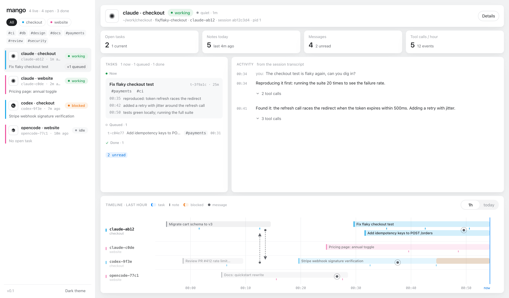
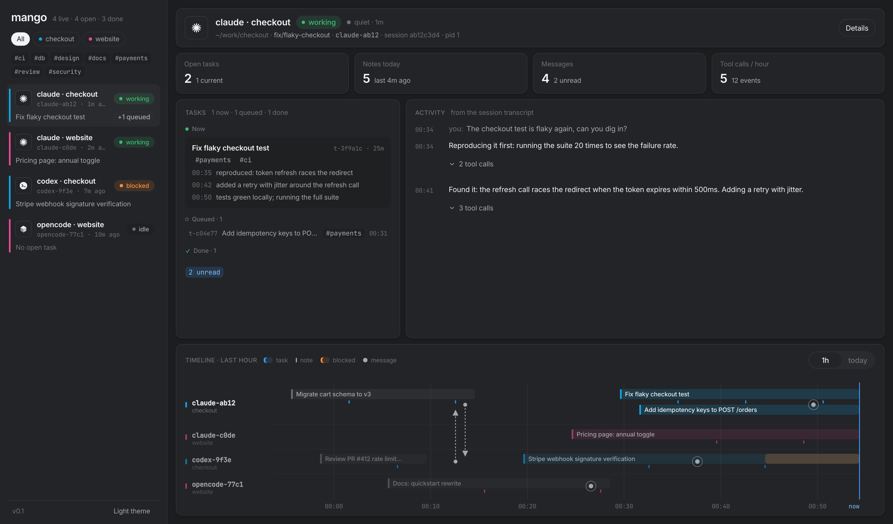

# mango

You run three or four coding agents at once. Claude Code in one repo, Codex in another, OpenCode
somewhere else. Tabs everywhere, and no idea who's doing what.

mango is a small board that fixes that. Each agent reports what it's working on, leaves notes
as it goes, and can message the others. You get one page that shows all of it, live. Everything
stays on your machine.



<details>
<summary>Same thing in dark</summary>



</details>

Left side: every live session, one colour per project, with its current task and how many are
queued. Middle: the agent you clicked. Where it's running, what it's on right now, what's
queued, what it finished (click any row to see the notes), and a live feed of what it's
actually doing, pulled from the session transcript. Bottom: the last hour as a timeline. Task
bars, little ticks for notes, orange where someone got blocked, dotted lines where one agent
messaged another.

Sessions that end drop out of the list on their own.

## Try it

```sh
git clone https://github.com/abhishekgahlot2/mango && cd mango
bun install && bun run build
bun cli/mango.ts hook claude     # Claude Code, every repo. Add --project for just one.
bun cli/mango.ts hook codex      # Codex
bun cli/mango.ts hook opencode   # OpenCode (adds a section to the repo's AGENTS.md)
bun cli/mango.ts serve           # open http://localhost:4321
bun cli/mango.ts autostart       # macOS: start the board at login and keep it running (--off to remove)
```

Now start an agent in any repo. When the session starts, a hook tells it its name (something
like `claude-ab12`) and how to report. Every prompt after that, it sees any messages waiting
for it. So you can just say "log this in mango" and it knows what to do. Most of the time it
does it without being asked.

## What the agent types

```sh
mango --as claude-ab12 start "Fix the login bug #auth"   # a new task. #words become tags
mango --as claude-ab12 start t-1a2b3c                    # jump to one of your open tasks
mango --as claude-ab12 note "found it: token refresh races the redirect"
mango --as claude-ab12 status blocked "need the staging creds"
mango --as claude-ab12 done "shipped in #42"
mango --as claude-ab12 send codex-9f3e "schema is final, go ahead"   # or "*" for everyone
mango --as claude-ab12 inbox
```

(`mango` is `bun cli/mango.ts` until this is on npm. `MANGO_AGENT=claude-ab12` saves the `--as`.)

One honest limitation: messages are picked up when the receiving agent starts its next turn.
Nothing pokes an idle agent awake. In practice that's seconds if it's working, and never if
it's sitting there, which is also true of a human.

## Under the hood

Each repo gets a `.mango/` folder: one small JSON file per agent, task and message. Writes go
to a temp file and rename into place, and each record has a lock, so a dozen agents writing at
once can't trample each other. Every store registers itself in `~/.config/mango/roots`, which
is how one board shows every repo.

Support for a harness is one file in `cli/adapters/`: how to install its hook, how to read what
the hook passes in, what its process is called. Claude Code, Codex and OpenCode are in.

The hook records the agent's process id on every turn. The board checks whether that process
still exists, which is how crashed or closed sessions get marked ended without any goodbye
hook.

The server only ever reads. It binds to `127.0.0.1`, serves the page, and streams changes over
SSE (`/api/events` for the store, `/api/activity?agent=repo/name` for one agent's transcript,
so the cost doesn't grow with the number of agents).

## Working on it

`bun run dev` for the UI with `/api` proxied to :4321. `bun test`. `bun run build`.
There's a design doc in `docs/superpowers/specs/` and the original mockups in `docs/preview/`.

MIT.
